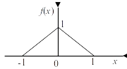
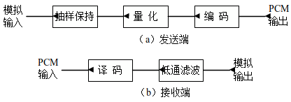

# 第十章 信源编码 #

*P328*

## 10-2 ##

对基带信号，进行理想抽样，为了在接收端能无失真地从抽样信号 $m(t) = \cos
2000\pi t + 2\cos 4000\pi t$ 中恢复 $m(t)$ 。

（1）抽样间隔应如何选择？

$$
\begin{aligned}
	f_\mathrm{m} = & 2000Hz\\
	B = & 2000 - 1000 = 1000Hz\\
	n = & \left\lfloor\frac{f_\mathrm{m}}{B}\right\rfloor = 2\\
	k = & \left\{\frac{f_\mathrm{m}}{B}\right\} = 0\\
	f_\mathrm{s} = & 2B\left(1 + \frac{k}{n}\right) = 2000Hz\\
	t_\mathrm{s} = & \frac{1}{f_\mathrm{s}} = 5 \times 10^{-4}s
\end{aligned}
$$

（2）若抽样间隔为0.2ms，试画出已抽样信号的频谱图。

$$
\begin{aligned}
	f_\mathrm{s} = & \frac{1}{t_\mathrm{s}} = 5000Hz\\
	\Omega_\mathrm{s} = & 2\pi f_\mathrm{s} = 10^4\pi rad/s\\
	H(\jmath\Omega) = & \pi\delta(\Omega - 2000\pi) + 2\pi\delta(\Omega -
	4000\pi)\\
	 & + \pi\delta(\Omega + 2000\pi) + 2\pi\delta(\Omega +
	4000\pi)\\
	H_\mathrm{s}(\jmath\Omega) = & f_\mathrm{s}H(\jmath\Omega) *
	\delta_\mathrm{\Omega_\mathrm{s}}(\Omega)
\end{aligned}
$$


[程序清单](#10_2_2)

## 10-7 ##

设信号 $m(t) = 9 + A\cos\omega t$ ，其中 $A \leqslant 10V$ 。若 $m(t)$ 被均匀
量化为40个电平，试确定所需的二进制码组的位数 $N$ 和量化间隔 $\Delta v$ 。

$$
\begin{aligned}
	\Delta v = & \frac{\max\limits_t m(t) - \min\limits_t m(t)}{M} =
	0.5V\\
	N = & \left\lceil\mathrm{lb}M\right\rceil = 6
\end{aligned}
$$

## 10-8 ##

已知模拟信号抽样值的概率密度 $f(x)$ 如图P10-3所示。若按4电平进行均匀量化，试
计算信号量化噪声功率比。



$$
\begin{aligned}
	\Delta v = & \frac{\max x - \min x}{M} = 0.5V\\
	q \sim & U(-\frac{\Delta v}{2}, \frac{\Delta v}{2})\\
	Eq^2 = & \frac{(\Delta v)^2}{12} = \frac{1}{48}W\\
	Ex^2 = & \int\nolimits_{-1}^1 x^2(1 - |x|)dx\\
	= & 2\int\nolimits_{-1}^1 (x^2 - x^3)dx\\
	= & \frac{1}{6}W\\
	r_q = & \frac{Ex^2}{Eq^2} = 8
\end{aligned}
$$

## 10-10 ##

设输入信号抽样脉冲值为 $+635\Delta$ （ $\Delta$ 表示一个最小量化单位），采用
13折线A律 PCM编码。试确定：

（1）此时编码器输出码组、编码电平和量化误差；

$$
\begin{aligned}
	635 = & 2^{4 + 5} + \frac{512}{16} \times 3 + 27\\
	I_\mathrm{s} = & 11100011_2\\
	i_\mathrm{c} = & 635 - 27 = 608\Delta\\
	q_\mathrm{c} = & 27\Delta
\end{aligned}
$$

（2）对应于该7位码（不含极性码）的均匀量化11位码；

$$
I_\mathrm{c} = 01001100000_2
$$

```{.octave}
dec2bin(608)
```

（3）译码电平和译码后的量化误差。

$$
\begin{aligned}
	635 = & 2^{4 + 5} + \frac{512}{32} \times 7 + 11\\
	i_\mathrm{d} = & 635 - 11 = 624\Delta\\
	I_\mathrm{d} = & 010011100000_2\\
	q_\mathrm{d} = & 11\Delta
\end{aligned}
$$

```{.octave}
dec2bin(624)
```

## 10-11 ##

采用13折线A律PCM编译码电路，设接收端译码器收到的码组为“01010011”，最小量化间
隔为1个量化单位（ $\Delta$ ）。试求：

（1）译码器输出（按量化单位 $\Delta$ 计算）；

$$
\begin{aligned}
	i_\mathrm{c} = & -\bigl(2^{4 + 4} + \frac{256}{16} \times (3 + \frac{1}{2})\bigr)\\
	= & -312\Delta
\end{aligned}
$$

（2）对应的12位（不含极性码）线性码（均匀量化）。

$$
\begin{aligned}
	I_\mathrm{c} = & 00100110000_2\\
	I_\mathrm{d} = & 001001110000_2
\end{aligned}
$$

```{.octave}
dec2bin(312)
```

## 10-14 ##

将一个带宽为4.2MHz的模拟信号，用如图10-17所示的PCM系统进行传输。要求接收机输
出端的量化信噪比至少为40dB。试求：

（1）若 $P_\mathrm{e} = 0$ ，求线性PCM码字所需的二进制编码位数 $N$ 和量化器所
需的量化电平数 $M$ ；

$$
\begin{aligned}
	r_q = & M^2 = 2^{2N} > & 10^{40/10}\\
	N = & 7\\
	M = & 2^7 = 128
\end{aligned}
$$

（2）系统传输的比特率；

$$
\begin{aligned}
	R_B = & 2B\\
	R_b = & NR_B = 58.8Mb/s
\end{aligned}
$$

（3）若设 $P_\mathrm{e} = 10^{-4}$ ，求系统输出的信噪比。



$$
\begin{aligned}
	r_n = & \frac{1}{4P_\mathrm{e}} = \frac{10^4}{4}\\
	r_q = & M^2 = 128^2\\
	r = & r_\mathrm{n} \parallel r_\mathrm{q}\\
	= & 2169
\end{aligned}
$$

## 10-15 ##

对10路带宽均为300～3400Hz的模拟信号进行PCM时分复用传输。设抽样速率为8000Hz，
抽样后进行8级量化，并编码为自然二进制码。试求：

（1）传输此复用信号的信息传输速率；

$$
\begin{aligned}
	R_{B1} = & f_\mathrm{s} = 8000B/s\\
	H = & \mathrm{lb}M = 3b/B\\
	R_{b1} = & HR_{B1} = 24000b/s\\
	R_b = & 10R_{b1} = 240kb/s
\end{aligned}
$$

（2）若传输码元波形是宽度为 $\tau$ 的矩形脉冲，且占空比为1，求所需的传输带宽
（第一谱零点带宽）和奈奎斯特基带带宽；

$$
\begin{aligned}
	T_b = & \frac{1}{R_b}\\
	\tau = & \eta T_b\\
	B = & \frac{1}{\tau} = 240kb/s\\
	f_\mathrm{N} = & \frac{B}{2} = 120kb/s
\end{aligned}
$$

（3）若矩形脉冲的占空比为 $\frac{1}{2}$ ，重做（2）。

$$
\begin{aligned}
	B = & \frac{R_b}{\eta} = 480kb/s\\
	f_\mathrm{N} = & \frac{B}{2} = 240kb/s
\end{aligned}
$$

## 10-18 ##

已知模拟信号 $f(t) = 10\sin 4000\pi t + \sin 8000\pi t$ （V），对其进行A律13
折线PCM编码。设以奈奎斯特速率进行抽样，一个输入抽样脉冲幅度为0.546875V，最小
量化间隔为1个量化单位（ $\Delta$ ）。试求：

（1）此时编码器的输出码组和量化误差；

$$
\begin{aligned}
	\theta(t) = & 4000\pi t\\
	f(t) = & 2(5 + \cos\theta(t))\sin\theta(t)\\
	x(t) = & \cos\theta(t) \in [-1, 1]\\
	f(t) = & 2\sqrt{25 + 10x(t) - 24x(t)^2 - 10x(t)^3 - x(t)^4}\\
	g(x) = & \left(\frac{f(t(x))}{2}\right)^2\\
	= & 25 + 10x - 24x^2 - 10x^3 - x^4\\
	\frac{d}{dx}g(x) = & 10 - 48x - 30x^2 - 4x^3\\
	& = -4(x + 5)(x - \frac{\sqrt{33} - 5}{4})(x - \frac{-\sqrt{33} -
	5}{4})\\
	x_0 & = \frac{\sqrt{33} - 5}{4} \in (-1, 1)\\
	\left(\frac{d}{dx}\right)^2g(x_0) & < 0\\
	t_0 & = \frac{\arccos \frac{\sqrt{33} - 5}{4}}{4000\pi}\\
	\max\limits_t f(t) = & f(t_0)\\
	\min\limits_t f(t) = & f(- t_0) = -f(t_0)\\
	\Delta = & \frac{\max\limits_t f(t) - \min\limits_t f(t)}{4096}
	\approx \frac{10.191}{2048}V\\
	i_\mathrm{s} = & \left[\frac{i}{\Delta}\right]\Delta =  110\Delta\\
	110 & = 2^{4 + 2} + \frac{64}{16} \times 2 + 14\\
	I_\mathrm{s} & = 10110010_2\\
	q_\mathrm{s} & = 14\Delta
\end{aligned}
$$

（2）若采用时分多路系统传输10路编码后的PCM信号，传输波形为非归零的矩形脉冲时
，试确定该PCM时分多路信号的信息传输速率和传输带宽（第一谱零点带宽）。

$$
\begin{aligned}
	f_\mathrm{m} = & 4000Hz\\
	B = & 2000Hz\\
	f_\mathrm{s} = & 2B = 4000Hz\\
	R_{B1} = & f_\mathrm{s} = 4000B/s\\
	R_{b1} = & HR_{B1} = 32kb/s\\
	R_b = & 10R_{b1} = 320kb/s\\
	B_0 = & \frac{R_b}{\eta} = 320kb/s
\end{aligned}
$$

## 附录 ##

### 10_2_2 ###

```{.octave}
%% input
tic;
clc;
clear;
close all;

%% process
ts = 0.2;
fs = 1 / ts;
ws = 2 * fs;
w1 = 2;
w2 = 4;
W = [w1 w2];
H = [1 2] * fs;
n = 2;
DW = W;
DH = H;
for i = 1:n
	W = [W DW + i * ws];
	H = [H DH];
end
W = [W, - fliplr(W)];
H = [H fliplr(H)];
st = stem(W, H, '^');
hold on;
xlabel('$\Omega/(\pi\mathrm{kHz})$');
ylabel('$H(\jmath\Omega)/(\pi \mathrm{kV}\cdot\mathrm{s})$');
set(gca, 'xtick', W);
set(gca, 'ytick', DH);
for i = - length(W) / 4:length(W) / 4 - 1
	plot([i * ws i * ws], [0 max(H)], ':');
end
print -dpdflatexstandalone '/tmp/10_2_2.tex';
system 'latexmk -cd -pvc- /tmp/10_2_2.tex';
system 'cp /tmp/10_2_2.pdf img/10_2_2.pdf';

%% output
toc;
```

