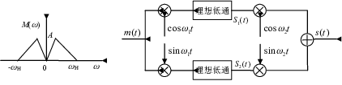

# 第五章 模拟调制系统 #

## P124 ##

### 5-4

已知调制信号 $m(t) = \cos 2000\pi t + \cos 4000\pi t$ ，载波为 $\cos 10^4 \pi t$
，进行单边带调制，试确定该单边带信号的表示式，并画出频谱图。

$$ \cos\alpha\cos\beta = \dfrac{\cos(\alpha + \beta) + \cos(\alpha - \beta)}{2}
$$
$$ \sin\alpha\sin\beta = \dfrac{\cos(\alpha + \beta) - \cos(\alpha - \beta)}{2}
$$
$$ s_-(t) = \dfrac{m(t)\cos \omega_\mathrm{c}t - \hat{m}(t)\sin
\omega_\mathrm{c}t}{2} = \dfrac{\cos 12000\pi t + \cos 14000\pi t}{2} $$
$$ S_-(\omega) = \dfrac{\pi}{2}\big(\delta(\omega + 14000\pi) +
\delta(\omega - 14000\pi) + \delta(\omega - 12000\pi) + \delta(\omega +
12000\pi)\big) $$

同理。

$$ s_+(t) = \dfrac{m(t)\cos \omega_\mathrm{c}t + \hat{m}(t)\sin
\omega_\mathrm{c}t}{2} = \dfrac{\cos 8000\pi t + \cos 6000\pi t}{2} $$
$$ S_+(\omega) = \dfrac{\pi}{2}\big(\delta(\omega + 8000\pi) +
\delta(\omega - 8000\pi) + \delta(\omega - 12000\pi) + \delta(\omega +
12000\pi)\big) $$

### 5-6

某调制方框图如图3(b)。已知 $m(t)$ 的频谱如图3(a)所示，载频 $\omega_1 \ll
\omega_2, \omega_1 \gg \omega_\mathrm{H}$ ，且理想低通滤波器的截止频率为
$\omega_1$ ，试求输出信号 $s(t)$ ，并说明 $s(t)$ 为何种已调信号。

$$ s_1(t) = \dfrac{m(t)\cos\omega_1t + \hat{m}(t)\sin\omega_1t}{2} $$
$$ s_2(t) = \dfrac{m(t)\sin\omega_1t - \hat{m}(t)\cos\omega_1t}{2} $$
$$ s(t) = s_1(t)\cos\omega_2t + s_2(t)\sin\omega_2t = \dfrac{m(t)\cos(\omega_2 -
\omega_1) - \hat{m}(t)\sin(\omega_2 - \omega_1)}{2} $$
$s(t)$ 是一个上边带信号。

### 5-8

设某信道具有均匀的双边噪声功率谱密度 $P_\mathrm{n}(f) = 0.5\times 10^{ - 8}$W/Hz
，在该信道中传输抑制载波的双边带信号，并设调制信号 $m(t)$ 的频带限制在5kHz，载波
频率为100kHz，发射信号功率 $S_\mathrm{T}$  $S_\mathrm{T}$ 为60dB，信道（指调制
信道）损耗 $\alpha$ 为70dB。试确定：

（1）解调器前端理想带通滤波器的中心频率和通带带宽；

$$ f_0 = 100kHz $$
$$ B = 2f_\mathrm{H} = 10kHz $$

（2）解调器输入端的信噪功率比；

$$ S_\mathrm{T} = 10^{60/10} = 10^6 $$
$$ \alpha = 10^{70/10} = 10^7 $$
$$ S_\mathrm{i} = \dfrac{S_\mathrm{T}}{\alpha} = 0.1W $$
$$ N_\mathrm{i} = 2P_\mathrm{n}(f)B = 10^{ - 4}W $$
$$ \mathrm{SNR}_\mathrm{i} = \dfrac{S_\mathrm{i}}{N_\mathrm{i}} = 1000 $$

（3）解调器输出端的信噪功率比；

$$ \mathrm{SNR}_\mathrm{o} = \mathrm{SNR}_\mathrm{i}G = 2000 $$

（4）解调器输出端的噪声功率谱密度。

$$ N_\mathrm{o} = \dfrac{N_\mathrm{i}}{4} = 2.5\times 10^{ - 4} $$
$$ P_\mathrm{no} = \dfrac{N_\mathrm{o}}{2f_\mathrm{H}} = 2.5\times 10^{ - 9},  |
f | \leqslant 5kHz $$

### 5-9
若将5-8题中的双边带信号改成
$s_\mathrm{SSB} = \dfrac{m(t)\cos \omega_\mathrm{c}t - \hat{m}(t)\sin
\omega_\mathrm{c}t}{2}$ ，其余条件不变，重复5-8的问题。

$$ f_0 = 102.5kHz, B = 5kHz $$

$$ N_\mathrm{i} = 2P_\mathrm{n}(f)f_\mathrm{H} = 5\times 10^{ - 5}W $$
$$ \mathrm{SNR}_\mathrm{i} = \dfrac{S_\mathrm{i}}{N_\mathrm{i}} = 2000 $$

$$ \mathrm{SNR}_\mathrm{o} = \mathrm{SNR}_\mathrm{i}G = 2000 $$

$$ N_\mathrm{o} = \dfrac{N_\mathrm{i}}{4} = 1.25\times 10^{ - 5}W $$
$$ P_\mathrm{no}(f) = \dfrac{N_\mathrm{o}}{2f_\mathrm{H}} = 1.25\times 10^{ -
9}W/Hz,  | f | \leqslant 5kHz $$

### 5-13
设AM调制系统中信道噪声的单边功率谱密度 $P_\mathrm{n}(f) = 10^{ - 7}W/Hz$ ，调制
信号 $m(t)$ 的频带限制在5kHz，载波频率为
100kHz，解调器输入端的边带信号功率为1W，载波功率为4W。若接收机的输入信号先经过一
个合适的理想带通滤波器，然后再加至包络检波器进行解调。试求：

（1）解调器输入端的信噪功率比；

$$ S_\mathrm{i} = 40 + 10 = 50kW $$
$$ N_\mathrm{i} = 2P_\mathrm{n}(f)B = 10W $$
$$ \mathrm{SNR}_\mathrm{i} = \dfrac{S_\mathrm{i}}{N_\mathrm{i}} =
\dfrac{50k}{10} = 5000 $$

（2）解调器输出端的信噪功率比；

$$ S_\mathrm{i} = 2\times 10 = 10kW $$
$$ N_\mathrm{o} = N_\mathrm{i} = 10W $$
$$ \mathrm{SNR}_\mathrm{o} = \dfrac{S_\mathrm{o}}{N_\mathrm{o}} =
\dfrac{20k}{10} = 2000 $$

（3）制度增益$G$。

$$ G = \dfrac{\mathrm{SNR}_\mathrm{o}}{\mathrm{SNR}_\mathrm{i}} = 0.4 $$

### 5-15

已知某单频调频波的振幅是10V，瞬时频率为 $f(t) = 10^6 + 10^4\cos 2\pi\times
10^3t$ Hz，试求：

（1）此调频波的表达式；

$$ \omega (t) = 2\pi f(t) $$
$$ \theta = \int\nolimits_{-\infty}^t \omega(\tau)d\tau = 2\pi(10^6t + 10^4\cos 2\pi\times 10^3t) $$
$$ s_\mathrm{FM} = 10\cos 2\pi(10^6t + 10^4\cos 2\pi\times 10^3t) $$

（2）此调频波的最大频率偏移、调频指数和频带宽度；

$$ \Delta f = 10kHz $$
$$ m_\mathrm{f} = \dfrac{\Delta f}{f_\mathrm{m}} = 10 $$
$$ B = 2(\Delta f + f_\mathrm{m}) = 22kHz $$

（3）若调频信号频率提高到 $2\times 10^3$ Hz，则调频波的频率偏移、调频指数和频带
宽度如何变化？

$$ \Delta f = 10kHz $$
$$ m_\mathrm{f} = \dfrac{\Delta f}{f_\mathrm{m}}5 $$
$$ B = 2(\Delta f + f_\mathrm{m}) = 24kHz $$

（4）若峰值频偏加倍，信息信号的幅度怎样变化？

$$ A' = 2A $$

### 5-16

已知调制信号是8MHz的单频余弦信号，且设信道噪声的单边功率谱密度 $n_0 =
5\times 10^{ - 15}$W/Hz ，信道损耗 $\alpha$ 为60dB 。若要求输出信噪比为40dB，试
求：

（1）100%解调时AM信号的带宽和发射功率；

$$ B_\mathrm{AM} = 2f_\mathrm{m} = 16MHz $$
$$ \mathrm{SNR}_\mathrm{o} = 10^{60/10}\times 10^{40/10} = 10^{10} $$
$$ S_\mathrm{i} = \mathrm{SNR}_\mathrm{i}n_0B_\mathrm{AM} = 800W $$
$$ S = \dfrac{S_\mathrm{i}}{2/3} = 1200W $$

（2）调频指数为5时FM信号的带宽和发射功率。

$$ B_\mathrm{FM} = (m_\mathrm{f} + 1)B_\mathrm{AM} = 96MHz $$
$$ G_\mathrm{FM} = 3m_\mathrm{f}^2(m_\mathrm{f} + 1) = 450 $$

