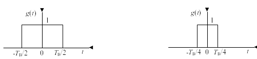
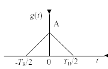
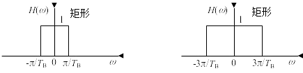
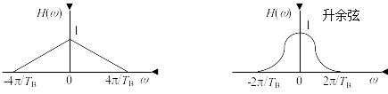
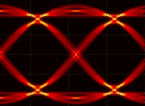
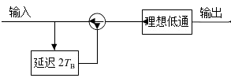
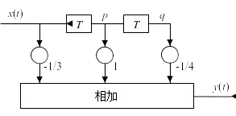

# 第六章 数字基带传输系统 #

## 6-4 ##

设二进制随机序列中的“0”和“1”分别由 $g(t)$ 和 $-g(t)$ 组成，它们的出现概率分别为
$P$ 和 $(1-P)$ 。试确定：

（1）该序列的功率谱密度和功率；
$$
\begin{aligned}
	ES & = PG(f) + (P - 1)G(f) = (2P - 1)G(f)\\
	DS & = P(1 - P)|2G(f)|^2\\
	P_s(f) & = f_BDS + \delta_{f_B}f_B^2|ES|^2\\
	& = 4f_BP(1 - P)|G(f)|^2 + f_B^2(2P - 1)^2\sum_{i =
	-\infty}^\infty |G(if_B)|^2\delta(f - if_B)\\
	P & = \int_{-\infty}^{\infty} P_s(f) \mathrm{d} f \\
	& = 4f_BP(1-P) \int_{-\infty}^{\infty} |G(f)|^2df + f_B^2(2P -
	1)^2\sum_{i = -\infty}^\infty |G(if_B)|^2
\end{aligned}
$$
（2）若 $g(t)$ 为如图 P6-1(a) 所示波形， $T_B$
为码元宽度，问该序列是否存在频率为 $f_B = \frac{1}{T_B}$
的离散分量。

否
$$
\begin{aligned}
	G(f) & = \mathscr{F}\mathrm{rect}\frac{t}{T_B/2} = T_B\mathrm{Sa}\pi
	T_Bf\\
	G(f_B) & = 0
\end{aligned}
$$
（3）若 $g(t)$ 为如图P6-1(b)所示波形，重新回答题（2）所问。



是

$$
\begin{aligned}
	G(f) & = \mathscr{F}\mathrm{rect}\frac{t}{T_B/4} =
	\frac{T_B}{2}\mathrm{Sa}\frac{\pi T_Bf}{2}\\
	G(f_B) & \neq 0
\end{aligned}
$$

## 6-5 ##

设某二进制数字基带信号的基本脉冲为三角形脉冲，如图P6-2所示。图中 $T_B$
为码元间隔，数字信息“1”和“0”分别用 $g(t)$
的有和无表示，且“1”和“0”出现概率相等。试确定：

（1）该基带信号的功率谱密度；
$$
\begin{aligned}
	G(f) & = A\mathscr{F}\mathrm{tri}\frac{t}{T_B/2}\\
	& = A\frac{\int\nolimits_{-\infty}^\infty \mathrm{tri}\frac{t}{T_B/2}
	dt}{(\int\nolimits_{-\infty}^\infty
	\mathrm{rect}\frac{t}{T_B/4})^2}\mathscr{F}\left(\mathrm{rect}\frac{t}{T_B/4} *
	\mathrm{rect}\frac{t}{T_B/4}\right)\\
	& = A\frac{2}{T_B}\left(\frac{T_B}{2}\mathrm{Sa}\frac{\pi T_Bf}{2}\right)^2\\
	& = \frac{AT_B}{2}\mathrm{Sa}^2\frac{\pi T_Bf}{2}\\
	P(f) & = f_BP(1 - P)|G(f)|^2 + \sum_{i = -\infty}^\infty |f_B(1 -
P)G(if_B)|^2\delta(f - if_B)\\
	& = \frac{f_B}{4}|G(f)|^2 + \frac{f_B^2}{4}\sum_{i = -\infty}^\infty
	|G(if_B)|^2\delta(f - if_B)\\
	& = \frac{A^2T_B}{16}\mathrm{Sa}^4\frac{\pi T_Bf}{2} +
	\frac{A^2}{16}\sum_{i = -\infty}^\infty \mathrm{Sa}^4\frac{\pi
	i}{2}\delta(f - if_B)
\end{aligned}
$$
（2）能否从该基带信号中提取位同步所需的频率分量？若能，试计算该分量的功率。



$$
\int\nolimits_{-\infty}^\infty \bigl(P(f_B) + P(-f_B)\bigr) df =
2\frac{A^2}{16}\int\nolimits_{-\infty}^\infty
\mathrm{Sa}^4\frac{\pi}{2}\delta(f - f_B)df
= \frac{2A^2}{\pi^4}
$$

## 6-7 ##

已知信码序列为 1011000000000101 ，试确定相应的 $\mathrm{AMI}$ 码及
$\mathrm{HDB}_3$ 码，并分别画出它们的波形。


```{.octave}
data = dlmread('tab/6.csv');
data_AMI = data(2, :);
data_AMI(1) = [];
AMI = stem(data_AMI);
set(AMI, 'linewidth', 20);
set(gca, 'ylim', [-10, 10]);
set(gca, 'ycolor', [1, 1, 1]);
set(gca, 'xcolor', [1, 1, 1]);
saveas(AMI, 'img/AMI.png');
system('convert img/AMI.png -trim +repage img/AMI.png');
figure;
data_HDB3 = data(4, :);
data_HDB3(1) = [];
HDB3 = stem(data_HDB3);
set(HDB3, 'linewidth', 20);
set(gca, 'ylim', [-10, 10]);
set(gca, 'ycolor', [1, 1, 1]);
set(gca, 'xcolor', [1, 1, 1]);
saveas(HDB3, 'img/HDB3.png');
system('convert img/HDB3.png -trim +repage img/HDB3.png');
```

## 6-11 ##

设基带传输系统的发送滤波器、信道及接收滤波器组成的总特性为 $H(\omega)$
，若要求以 $\frac{2}{T_B}$
波特的速率进行数据传输，验证图P6-5所示的各种 $H(\omega)$
能否满足抽样点上无码间串扰的条件？





$$
\begin{aligned}
	R_B & = \frac{2}{T_B}\\
	T'_B & = \frac{1}{R_B} = \frac{T_B}{2}\\
	\omega_B & = \frac{2\pi}{T'_B} = \frac{4\pi}{T_B}\\
	h(t) * \delta_{T'_B}(t) & = k\delta(t)\\
	\frac{1}{T_B}H(\omega)* \delta_{\omega_B}(\omega) & = k\\
	\sum_{i = -\infty}^\infty H\left(\omega -
	i\frac{4\pi}{T_B}\right) & = kT_B\\
	H(\omega) & = 0, \omega \notin \left(-\frac{4\pi}{T_B},
	\frac{4\pi}{T_B}\right)\\
	H(\omega) &  = H(-\omega)\\
	H(\omega) + H(\omega - \frac{4\pi}{T_B}) & = kT_B, \omega \in (0,
	\frac{4\pi}{T_B})\\
\end{aligned}
$$

a 否， b 否， c 是， d 否。

## 6-14 ##

设某基带传输系统的频率特性 $|H(\omega)|$
为余弦滚降频谱，传输信号为四电平基带脉冲序列，能够实现无ISI传输的最高信息速率为
$R_b = 2400b/s$ ，试确定：

（1）滚降系数 $\alpha = 0.4$ 时的系统带宽和最高频带利用率；
$$
\begin{aligned}
	\eta_B & = \frac{2}{1 + \alpha} = \frac{10}{7}B\\
	H & = \mathrm{lb}M = 2b/B\\
	\eta_b & = H\eta_B = \frac{20}{7}b\\
	B & = \frac{R_b}{\eta_b} = 840Hz
\end{aligned}
$$
（2）滚降系数 $\alpha = 1$ 时的系统带宽和最高频带利用率；
$$
\begin{aligned}
	B' & = 1200Hz\\
	\eta_b' & = 2b/Hz
\end{aligned}
$$
（3）若以800b/s的速率传输时，有无ISI？
$$
\frac{2400}{800} = 3 \in \mathbb{Z}
\Rightarrow
无ISI
$$

## 6-18 ##

某二进制基带传输系统所传送的是双极性基带信号，且数字信息“1”和“0”的出现概率相等
。

（1）若数字信息为“1”时，接收滤波器输出信号在抽样判决时刻的值 $A =  1\mathrm{V}$
 ，且接收滤波器输出噪声的均值为0，均方根为0.2V的高斯噪声，试求这时的误码率
 $P_e$ ；

$$
\begin{aligned}
	r & = \frac{A^2/2}{\sigma^2} = \frac{25}{2}\\
	P_\mathrm{e} & = \frac{1}{2}\mathrm{erfc}\sqrt{r}\\
	& \approx \frac{1}{2}\frac{2}{\sqrt{\pi}}\frac{\exp(-r)}{2\sqrt{r}}\\
	& = \frac{\exp(-r)}{2\sqrt{\pi r}}\\
	& \approx 2.87 \times 10^{-7}
\end{aligned}
$$
（2）若要求误码率 $P_e$ 不大于 $10^{-5}$ ，试确定 $A$ 至少应该是多少？
$$
\begin{aligned}
	P_\mathrm{e} & \leqslant 10^{-5}\\
	A & \geqslant 4.3\sigma
\end{aligned}
$$

## 6-19 ##

一随机二进制序列为
10110001，“1”码对应的基带波形是峰值为1的升余弦波形，持续时间为 $T_B$
；“0”码对应的基带波形与“1”码的极性相反。

（1）当示波器扫描周期 $T_0 = T_B$ 时，试画出眼图；


（2）当扫描周期 $T_0 = 2T_B$ 时，试画出眼图；



（3）比较以上两种眼图的最佳抽样判决时刻、判决门限电平及噪声容限值。[^1][^2]


[^1]: 表格中插入中文就会乱码，我怀疑这是软件的bug 。
[^2]: 另，表格中也不能插入脚注。

## 6-20 ##

某相关编码的系统如图P6-8所示。图中，理想低通滤波器的截止频率为
$\frac{1}{2T_B}$ Hz，通带增益为 $T_B$
。试求该系统的单位冲激响应和频率特性。



$$
\begin{aligned}
	h_1(t) & = \delta(t) - \delta(t - 2T_B)\\
	H_1(\omega) & = \mathscr{F}h_1(t)\\
	& = 1 - \exp(-2\jmath\omega T_B)\\
	H(\omega) & = H_1(\omega)H_\mathrm{L}(\omega)\\
	& = \bigl(1 - \exp(-2\jmath\omega T_B)\bigr)T_B
	\mathrm{rect}\frac{\omega}{2\pi/(2T_B)}\\
	& = \bigl(1 - \exp(-2\jmath\omega T_B)\bigr)T_B
	\mathrm{rect}\frac{\omega}{\pi/T_B}\\
	|H(\omega)| & = \bigl(\exp(\jmath\omega T_B) - \exp(-\jmath\omega
	T_B)\bigr)T_B \mathrm{rect}\frac{\omega}{\pi/T_B}\\
	& = 2T_B\sin\omega T_B\mathrm{rect}\frac{\omega}{\pi/T_B}\\
	h_\mathrm{L}(t) & = \mathscr{F}^{-1}H_\mathrm{L}(\omega)\\
	& = \frac{T_B}{2\pi}\left(
	\mathscr{F}\mathrm{rect}\frac{t}{\pi/T_B}\middle)\right|_{\omega = t}\\
	& = \frac{T_B}{2\pi}\mathrm{Sa}\frac{t}{T_B/\pi}\\
	h(t) & = h_1(t) * h_\mathrm{L}(t)\\
	& = \frac{T_B}{2\pi}\mathrm{Sa}\frac{t}{T_B/\pi} -
	\frac{T_B}{2\pi}\mathrm{Sa}\frac{t - 2T_B}{T_B/\pi}
\end{aligned}
$$

## 6-23 ##

设有一三抽头的时域均衡器，如图P6-9所示，输入信号 $x(t)$
在各抽样点的值依次为 $x_{-2} = \frac{1}{8}$ 、 $x_{-1} = \frac{1}{3}$ 、 $x_0 =
1$ 、 $x_1 = \frac{1}{4}$ 、 $x_2 = \frac{1}{16}$
，在其他抽样点均为零，试求均衡器输入波形 $x(t)$ 的峰值失真及输出波形 $y(t)$
的峰值失真。



$$
\begin{aligned}
	y & = c * x\\
	c & =
	\begin{bmatrix}
		-\frac{1}{3} & \mathop{1}\limits_{\uparrow} & -\frac{1}{4}
	\end{bmatrix}
	\\
	y & =
	\begin{bmatrix}
	-\frac{1}{24} & \frac{1}{72} & -\frac{1}{32} &
	\mathop{\frac{5}{6}}\limits_\uparrow &
	-\frac{5}{6} & -\frac{1}{48} & 0
	\end{bmatrix}
	\\
	D_x & = \frac{1}{x_0}\sum_{i \in \mathbb{Z}^*} |x_i| = \frac{37}{48}\\
	D_y & = \frac{1}{y_0}\sum_{i \in \mathbb{Z}^*} |y_i| = \frac{71}{640}
\end{aligned}
$$

## 6-24 ##

设计一三抽头的时域均衡器。已知输入信号 $x(t)$ 在各抽样点的值依次为 $x_{-2} = 0$
、 $x_{-1} = 0.2$ 、 $x_0 = 1$ 、 $x_1 = -0.3$ 、 $x_2 = 0.1$
，在其他抽样点均为零。

（1）求三个抽头的最佳系数；
$$
\begin{aligned}
\begin{bmatrix}
	x_0 & x_{-1} & x_{-2}\\
	x_1 & x_0 & x_{-1}\\
	x_2 & x_1 & x_0
\end{bmatrix}
\begin{bmatrix}
	c_{-1}\\
	c_0\\
	c_1
\end{bmatrix}
& =
\begin{bmatrix}
	0\\
	1\\
	0
\end{bmatrix}
\\
\begin{bmatrix}
	c_{-1}\\
	c_0\\
	c_1
\end{bmatrix}
& =
\begin{bmatrix}
	-0.18\\
	0.89\\
	0.28
\end{bmatrix}
\end{aligned}
$$
（2）比较均衡前后的峰值失真。
$$
\begin{aligned}
	y & = c * x\\
	D_x & = \frac{1}{x_0}\sum_{i \in \mathbb{Z}^*} |x_i| = 0.6\\
	D_y & = \frac{1}{y_0}\sum_{i \in \mathbb{Z}^*} |y_i| = 0.08
\end{aligned}
$$

