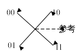

# 第七章 数字带通传输系统 #

## 7-2 ##

已知某 2FSK 调制系统的码元速率为2000
Baud，已知信号的载频为6000Hz（对应“1”码）和
4000Hz（对应“0”码）。

（1）若发送的信息序列为 1011001，试画出 2FSK 信号的时间波形；


```{.octave}
%% input
tic;
clc;
clear;
close all;
% load signal toolbox
pkg load signal;

%% process
% signal
A = [1 0 1 1 0 0 1];
% carrier
w1 = 6000 * 2 * pi;
w2 = 4000 * 2 * pi;
fn_w = @(x) w1 * (x == 1) + w2 * (x == 0);
% rectangle pulse
tb = 1 / 2000;
fn_Rect = @(t) rectpuls(t / tb + 1 / 2 - (1:length(A)));
% encoded signal
fn_s = @(t) sum(fn_Rect(t) .* cos(fn_w(A) * t));
dt = tb / 100;
tm = length(A) * tb;
X = 0:dt:tm;
Y = zeros(1, length(X));
for i = 1:length(X)
	Y(i) = fn_s(X(i));
end
pl = plot(X, Y);
xlabel('$t/\mathrm{s}$');
ylabel('$u(t)/\mathrm{V}$');
hold on;
for i = 1:length(A) - 1
	plot([i * tb i * tb], [-1 1], ':');
end
print -dpdflatexstandalone '/tmp/7_2_1.tex';

%% output
system 'latexmk -cd -pvc- /tmp/7_2_1.tex';
system 'cp /tmp/7_2_1.pdf img/7_2_1.pdf';
toc;
```

（2）试画出 2FSK 信号的功率谱示意图，并计算 2FSK 信号的第一谱零点带宽；

$$
\begin{aligned}
	e(t) & = \sum_{i = -\infty}^\infty \mathrm{rect}\left(\frac{t}{T_B}＋
	\frac{1}{2} - i\right)\cos(\omega_{s_i}t)\\
	& = \sum_{i = -\infty}^\infty
	s_i\mathrm{rect}\left(\frac{t}{T_B} + \frac{1}{2} -
	i\right)\cos(\omega_1t) + \sum_{i = -\infty}^\infty (1 -
	s_i)\mathrm{rect}\left(\frac{t}{T_B} + \frac{1}{2} -
	i\right)\cos(\omega_0t)\\
	& = s(t)\cos(\omega_1t) +
	\bar{s}(t)\cos(\omega_0t)\\
	P_s(f) & = f_B|DG| + \delta_{f_B}f_B^2|EG|^2\\
	& = \frac{T_B^2\mathrm{sinc}^2\frac{f}{f_B}}{4}(f_B +
	\delta_{f_B}f_B^2)\\
	& = \frac{T_B + \delta_{f_B}}{4}\mathrm{sinc}^2\frac{f}{f_B}\\
	&  = \frac{T_B\mathrm{sinc}^2\frac{f}{f_B} + \delta(f)}{4}\\
	P_{\bar{s}}(f) & = P_s(f)\\
	P_e(f) & = \frac{\delta(f + f_1) + \delta(f - f_1) + \delta(f + f_0) +
	\delta(f - f_0)}{4} * P_s(f)\\
	& = \frac{P_s(f + f_1) + P_s(f - f_1) + P_s(f + f_0) + P_s(f -
	f_0)}{4}\\
	B & = 2f_B + |f_1 - f_0| = 6000Hz
\end{aligned}
$$


我又检查了一遍，应该就是双峰啊。单峰绝对有问题。

```{.octave}
%% input
tic;
clc;
clear;
close all;

%% process
f1 = 6000;
f0 = 4000;
fb = 2000;
tb = 1 / fb;
fn_ps = @(f) tb * (sinc(f / fb)) .^ 2 / 4;
fn_pe = @(f) (fn_ps(f + f1) + fn_ps(f - f1) + fn_ps(f + f0) + fn_ps(f - f0)) / 4;
Pe = [-f1 -f0 f0 f1];
df = fb / 100;
X =  - 2 * f1:df:2 * f1;
Y  = fn_pe(X);
plot(X, Y);
xlabel('$f/\mathrm{Hz}$');
ylabel('$P_s(f)/\mathrm{J}$');
hold on;
st = stem(Pe, ones(1, length(Pe)) / 16 * tb);
set(st, 'marker', '^');
legend('continuous', 'discrete')
print -dpdflatexstandalone '/tmp/7_2_2.tex';
system 'latexmk -cd -pvc- /tmp/7_2_2.tex';
system 'cp /tmp/7_2_2.pdf img/7_2_2.pdf';

%% output
toc;
```

（3）讨论应选择什么解调方法解调该 2FSK 信号。

相干解调, 因为误码率更低。

## 7-5 ##

设发送的绝对码序列为 011010，采用 2DPSK 系统传输的码元速率为1200 Baud，载频为
1800Hz，并定义 $\Delta\varphi$ 为后一个码元起始相位和前一个码元结束相位之差。试
画出：

（1） $\Delta\varphi = 0\degree$ 代表“0”， $\Delta\varphi = 180\degree$ 代表“1”
时的 2DPSK 信号波形；

（2） $\Delta\varphi = 270\degree$ 代表“0”， $\Delta\varphi = 90\degree$ 代表“1
”时的 2DPSK 信号波形。

$$
\begin{aligned}
	b_0 & = 0\\
	b_n & = b_{n - 1} \oplus a_n\\
	b_n & =
	\begin{bmatrix}
	0 & 1 & 0 & 0 & 1 & 1
	\end{bmatrix}, n > 0\\
	e(t) & = \sum_{i = -\infty}^\infty \mathrm{rect}\left(\frac{t}{t_B} +
	\frac{1}{2}- i\right)\cos(\omega_ct + \Delta\varphi_{b_i})\\
	& = b(t)\cos(\omega_ct + \Delta\varphi_1) +
	\bar{b}(t)\cos(\omega_ct + \Delta\varphi_2)
\end{aligned}
$$


```{.octave}
%% in
tic;
clc;
clear;
close all;
pkg load signal;

%% process
B = [0 1 0 0 1 1];
C = [3 1 2 1 2 1];
fb = 1200;
tb = 1 / fb;
fc = 1800;
wc = fc * 2 * pi;
fn_Rect = @(t) rectpuls(t / tb + 1 / 2 - (1:length(B)));
fn_phi1 = @(t) 0 * (t == 0) + pi * (t == 1);
fn_phi2 = @(t) 0 * (t == 0) + pi / 2 * (t == 1) + pi * (t == 2) + 3 * pi / 2 * (t == 3);
fn_e1 = @(t) sum(fn_Rect(t) .* cos(wc * t + fn_phi1(B)));
fn_e2 = @(t) sum(fn_Rect(t) .* cos(wc * t + fn_phi2(C)));
dt = tb / 100;
tm = tb * length(B);
X = 0:dt:tm;
Y1 = zeros(1, X);
Y2 = zeros(1, X);
for i = 1:length(X)
	Y1(i) = fn_e1(X(i));
	Y2(i) = fn_e2(X(i));
end
pl1 = plot(X, Y1);
xlabel('$t/\mathrm{s}$');
ylabel('$u(t)/\mathrm{V}$')
hold on;
pl2 = plot(X, Y2);
set(pl2, 'color', 'red');
legend('1', '2');
for i = 1:length(B) - 1
	plot([i * tb i * tb], [-1 1], ':');
end
print -dpdflatexstandalone '/tmp/7_5.tex';
system 'latexmk -cd -pvc- /tmp/7_5.tex';
system 'cp /tmp/7_5.pdf img/7_5.pdf';

%% output
toc;
```

## 7-6 ##

对OOK信号进行相干接收，已知发送“1”和“0”符号的概率分别为 $P$ 和 $(1-P)$ ，接收端
解调器输入信号振幅为 $a$ ，窄带高斯噪声的方差为 $\sigma_\mathrm{n}^2$
。试确定：

（1）当 $P = \frac{1}{2}$ ，信噪比 $r = 10$ 时，系统的最佳判决门限 $b^*$
和误码率 $P_\mathrm{e}$ ；

$$
\begin{aligned}
	f_1(x) & = \frac{1}{\sqrt{2\pi}\sigma_\mathrm{n}}\exp\frac{-(x -
	1)^2}{2\sigma_\mathrm{n}^2}\\
	f_0(x) & = \frac{1}{\sqrt{2\pi}\sigma_\mathrm{n}}
	\exp\frac{-x^2}{2\sigma_\mathrm{n}^2}\\
	Pf_1(b^*) & = (1 - P)f_0(b^*)\\
	b^* & = \frac{a}{2} + \frac{\sigma_\mathrm{n}^2}{a}\ln\frac{1 - P}{P} =
	\frac{a}{2}\\
	P_\mathrm{e} & = \frac{1}{2}\mathrm{erfc}\frac{\sqrt{r}}{2}\\
	& \approx \frac{1}{\sqrt{\pi r}}\exp{\frac{-r}{4}}\\
	& \approx 2.37 \times 10^{-2}
\end{aligned}
$$

（2）当 $P < \frac{1}{2}$ 时的最佳判决门限值比 $P = \frac{1}{2}$ 时的大还是小？

$$
\begin{aligned}
	b^* & = \frac{a}{2} + \frac{\sigma_\mathrm{n}^2}{a}\ln\frac{1 - P}{P}\\
	& = \frac{a}{2} + \frac{\sigma_\mathrm{n}^2}{a}\ln(\frac{1}{P} - 1)\\
	& P \nearrow, b^* \searrow
\end{aligned}
$$

大

## 7-12 ##

已知数字信息为“1”时，发送信号的功率为1kW，信道损耗 $\alpha$
为60dB，接收端解调器输入的噪声功率为 $10^{-4}$
W，试求包络检波OOK和相干解调2PSK系统的误码率。

$$
\begin{aligned}
	\alpha & = 10^{-60/10} = 10^{-6}\\
	r & = \frac{S_0\alpha}{N_i} = 10\\
	P_{\mathrm{e}_1} & = \frac{1}{2}\exp{\frac{-r}{4}}\\
	& \approx 0.04\\
	P_{\mathrm{e}_1} & = \frac{1}{2}\mathrm{erfc}\sqrt{r}\\
	& \approx \frac{1}{2\sqrt{\pi r}}\exp{(-r)}\\
	& \approx 3.96 \times 10^{-6}
\end{aligned}
$$

## 7-13 ##

设发送的二进制信息序列为 10110001，试按下表所示的A方式编码规则，分别画出QPSK和
QDPSK信号的波形示意图。


$$
\begin{aligned}
	\varphi(c_nd_n) & \equiv k - \frac{\pi}{2}g^{-1}(c_nd_n), \pmod{2\pi}\\
	\Delta\varphi(a_nb_n) & \equiv \frac{\pi}{2} -
	\frac{\pi}{2}g^{-1}(a_nb_n), \pmod{2\pi}\\
	g(a_nb_n): & 原码a_nb_n 的\text{Gray}码。\\
	g^{-1}(a_nb_n): & \text{Gray}码a_nb_n 的原码。\\
	\varphi(c_nd_n) & \equiv \varphi(c_{n - 1}d_{n - 1}) +
	\Delta\varphi(a_nb_n), \pmod{2\pi}\\
	g^{-1}(c_nd_n) & \equiv g^{-1}(c_{n - 1}d_{n - 1}) + g^{-1}(a_nb_n) -
	1, \pmod{4}\\
	g^{-1}(xy) & = 2x + x \oplus y\\
	c_n \oplus d_n & = c_{n - 1} \oplus d_{n - 1} + a_n \oplus b_n - 1, \pmod{2}\\
	c_n & = c_{n - 1} + a_n + \left\lfloor\frac{c_{n - 1} \oplus d_{n
	- 1} + a_n \oplus b_n - 1}{2}\right\rfloor, \pmod{2}\\
	当c_{n - 1} \oplus d_{n - 1} = 1 & : \\
	c_n & \equiv c_{n - 1} + a_n + \left\lfloor\frac{a_n \oplus
	b_n}{2}\right\rfloor, \pmod{2}\\
	& \equiv c_{n - 1} + a_n, \pmod{2}\\
	& = c_{n - 1} \oplus a_n\\
	c_n \oplus d_n & \equiv a_n \oplus b_n, \pmod{2}\\
	d_n & = a_n \oplus b_n \oplus c_n\\
	& = a_n \oplus b_n \oplus c_{n - 1} \oplus a_n\\
	& = b_n \oplus c_{n - 1}\\
	& = \overline{b_n \oplus d_{n - 1}}\\
	当c_{n - 1} \oplus d_{n - 1} = 0 & : \\
	同理： & \\
	c_n & = \overline{c_{n - 1} \oplus b_n}\\
	d_n & = d_{n - 1} \oplus a_n\\
\end{aligned}
$$
试着证明了一下 QDPSK 递推公式。当时想的是要是能找到一个对任意形状的QPSK星座图都
成立的通式就好了，事实证明这公式太复杂了，如果码元个数不多的话，还是设一个初始
相位一个个推快一点。

另外发现2个结论：
1. QDPSK 的 $\Delta\varphi$ 和 $\varphi$ 的星座图必须同向方程才能有解。
2. QDPSK 的 $\varphi$ 的星座图旋转方向 $k$ 与解无关。影响QDPSK 最终波形的是
   $(c_0d_0)$ 。
$$
\begin{aligned}
	a_nb_n & =
	\begin{bmatrix}
	10 & 11 & 00 & 01
	\end{bmatrix}\\
	c_0d_0 & = 01\\
	c_nd_n & =
	\begin{bmatrix}
	10 & 00 & 10 & 10
	\end{bmatrix}\\
	e_\mathrm{QPSK}(t) & = \sum_{i = -\infty}^\infty
	\mathrm{rect}\left(\frac{t}{t_B} + \frac{1}{2} - i\right)\cos(\omega_ct
	+ \Delta\varphi(a_ib_i))\\
	& = \sum_{i = 0}^1\sum_{j = 0}^1\sum_{n = -\infty}^\infty
	\chi_{(a_nb_n) =
	(ij)}(t)\cos(\omega_ct + \Delta\varphi(ij))\\
	e_\mathrm{QDPSK}(t) & = \sum_{i = 0}^1\sum_{j = 0}^1\sum_{n =
	-\infty}^\infty \chi_{(c_nd_n) = (ij)}\cos(\omega_ct +
	\varphi(ij))\\
\end{aligned}\\
\chi_A =
\begin{dcases}
	1, A为真\\
	0, A为假
\end{dcases}
$$


```{.octave}
%% in
tic;
clc;
clear;
close all;
pkg load signal;

%% process
A = [2 3 0 1];
B = [2 0 2 2];
fb = 1200;
tb = 1 / fb;
fc = 1800;
wc = fc * 2 * pi;
fn_Rect = @(t) rectpuls(t / tb + 1 / 2 - (1:length(B)));
fn_phi = @(t) pi / 2 * (t == 0) + 0 * (t == 1) + pi * (t == 2) + 3 * pi / 4 * (t == 3);
fn_e1 = @(t) sum(fn_Rect(t) .* cos(wc * t + fn_phi(A)));
fn_e2 = @(t) sum(fn_Rect(t) .* cos(wc * t + fn_phi(B)));
dt = tb / 100;
tm = tb * length(B);
X = 0:dt:tm;
Y1 = zeros(1, X);
Y2 = zeros(1, X);
for i = 1:length(X)
	Y1(i) = fn_e1(X(i));
	Y2(i) = fn_e2(X(i));
end
pl1 = plot(X, Y1);
xlabel('$t/\mathrm{s}$');
ylabel('$u(t)/\mathrm{V}$')
hold on;
pl2 = plot(X, Y2);
set(pl2, 'color', 'red');
legend('QPSK', 'QDPSK');
for i = 1:length(B) - 1
	plot([i * tb i * tb], [-1 1], ':');
end
print -dpdflatexstandalone '/tmp/7_13.tex';
system 'latexmk -cd -pvc- /tmp/7_13.tex';
system 'cp /tmp/7_13.pdf img/7_13.pdf';

%% output
toc;
```

## 7-16 ##

已知2PSK系统的传输速率为2400b/s，试确定：

（1）2PSK信号的主瓣带宽和频带利用率（b/(s·Hz)）；

$$
\begin{aligned}
	H & = 1b/B\\
	R_B & = \frac{R_b}{H}\\
	B_0 & = R_B\\
	B & = 2B_0 = 4800Hz\\
	\eta_b & = \frac{R_b}{B} = \frac{1}{2}
\end{aligned}
$$

（2）若对基带信号采用 $\alpha =0.4$ 余弦滚降滤波预处理，再进行2PSK调制，这时占用
的信道带宽和频带利用率为多大？

$$
\begin{aligned}
	B'_0 & = \frac{R_B}{2}(1 + \alpha)\\
	B' & = 2B'_0 = 3360Hz\\
	\eta'_b & = \frac{R_b}{B'} = 0.71b
\end{aligned}
$$

（3）若传输带宽不变，而传输速率增至7200b/s，则调制方式应作和变化？

$$
\begin{aligned}
	R'_b & = 3R_b\\
	B' & = B\\
	\eta'_b & = 3\eta_b = 3\eta_B\\
	H & = 3\\
	M & = 2^H = 8
\end{aligned}
$$

改为8PSK 。

## 补充题： 7-补1 ##

已知某QPSK信号的矢量图下图所示。若该QPSK系统采用正交调相法，试给出其调制器的原
理框图。



1. 信号先通过串并联转换器得到2路二进制信号。
2. 再通过双极性变换器，0变换为1,1变换为 -1 。
3. 高位二进制信号与 $\cos(\omega t + \pi)$ 相乘，低位二进制信号与
$\cos(\omega t + \frac{\pi}{2})$ 相乘。
4. 2路乘法器结果相加即满足题意的QPSK 信号。
5. 顺带一提，方法是不唯一的，双极性变换器的变换结果反过来，载波信号相位得再加
   $\pi$ 。

图我不画了。不想再写代码了。

昨天的7-13 题答案有误。今天重新发了一份邮件。以下内容是今天加的，昨天邮件的附件
里没有。

向老师抱个歉，我在QQ群看到那个 $-\frac{1}{72}$ 的bug 了。是我的锅。

但我也有话想对老师说。

我一直以真正的工程师的要求对待自己。工程师是什么呢？我个人的理解是：一个普通的
工程师是能使用自己手边的工具解决（客户或自己的）需求的人，而一个真正的工程师则
是超越（灵活使用）工具而面向真正的需求的存在。所以昨天的作业里求那个 $y$, 我会
直接这样解决：

```{.octave}
c = [-1/3 1 -1/4];
x = [1/8 1/3 1 1/4 1/16];
y = conv(c, x)
```

让计算机代替人进行繁杂的计算，这是灵活地使用工具。但这还不够。因为我真正的需求
不是做作业：是学到知识。时域均衡器本质就是一个FIR，输出就是输入和 $c(n)$ 的卷积
，这个知识我已经知道啦。所以我觉得既然已经完成了需求，就没有必要浪费时间。灵活
使用工具：这个工具是计算机，是人的手算，甚至是答案，这真的重要吗？列出表达式，
证明我知道这个知识，如何得到答案——然后通过某个工具得到答案，写上它。这就够了。

我可能不是一个通常意义的好学生（遵守所有的规则），但我也有我自己的准则。不该做
的也确实不能做，所以我为这次越界感到抱歉。以后我会更加小心的。

PS: 自己手算的结果有可能会错，权威给出的结论也不一定正确，倒是计算机从未欺骗
过我呢。

