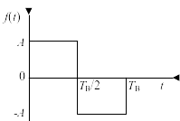
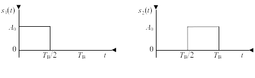

# 第九章 数字信号的最佳接收 #

## 9-3 ##

设 2FSK 信号为

$$
\begin{dcases}
	s_0(t) = A\sin 2\pi f_0t\\
	s_1(t) = A\sin 2\pi f_1t
\end{dcases}
$$

且 $f_0 = \frac{2}{T}$ ， $f_1 = 2f_0$ ， $s_0(t)$ 和 $s_1(t)$ 等概率出现。

（1）试画出其相关接收机原理框图；


（2）若发送码元为 010，试画出接收机各点的时间波形；


（3）设信道高斯白噪声的单边功率谱密度为 $\frac{n_0}{2}$ (W/Hz)，试求系统的误码
率。

$$
\begin{aligned}
	P_\mathrm{e} & = \frac{1}{2}\mathrm{erfc}\sqrt{\frac{E}{2n_0 / 2}}\\
	& = \frac{1}{2}\mathrm{erfc}\sqrt{\frac{A^2T}{2n_0}}
\end{aligned}
$$

## 9-5 ##

设二进制双极性信号最佳基带传输系统中，信号码元“1”和“0”是等概率发送的，接收波形
是持续时间为 $T_B$ ，幅度为1的矩形脉冲，信道加性高斯白噪声的双边功率谱密度为
$10^{-6}$ (W/Hz)。试问为使误码率不大于 $10^{-5}$ ，最高码元传输速率可以达到多高
？

$$
\begin{aligned}
	P_\mathrm{e} & = \frac{1}{2}\mathrm{erfc}\sqrt{\frac{E}{n_0}}\\
	& = \frac{1}{2}\mathrm{erfc}\sqrt{\frac{T_\mathrm{B}}{n_0}}\\
	& < 10^{-5}\\
	R_\mathrm{B} &  = \frac{1}{T_\mathrm{B}} < 5.6 \times 10^6B/s
\end{aligned}
$$

## 9-8 ##

在双边功率谱密度为 $\frac{n_0}{2}$ 的高斯白噪声背景下，设计一个与图P9-1中的信号
波形相应的匹配滤波器，并确定：

（1）最大输出信噪比的时刻；

$T_B$

（2）该滤波器的冲激响应和输出信号波形的表示式，并绘出波形；



$$
\begin{aligned}
	h(t) = & f(T_B - t_0)\\
	= & -A\Bigg(u(t) - u\left(t - \frac{T_\mathrm{B}}{2}\right)\Bigg) +
	 A\Bigg(u\left(t - \frac{T_\mathrm{B}}{2}\right) - u(t -
	 T_\mathrm{B})\Bigg)\\
	y(t) = & f(t) * h(t)\\
	 = & -A^2 \Bigg(u(t) - u\left(t -
	 \frac{T_\mathrm{B}}{2}\right)\Bigg) + (3t -
	 2T_\mathrm{B})A^2 \left(u\Bigg(\frac{T_\mathrm{B}}{2}\right) -
	 u(t - T_\mathrm{B})\Bigg)\\
	  & + (4T_\mathrm{B} - 3t)A^2\left(u(t - T_\mathrm{B}) - u\left(t -
	  \frac{3}{2}T_\mathrm{B}\right)\right) + (t - 2T_\mathrm{B})A^2
	  \Bigg(u\left(t - \frac{3}{2}T_\mathrm{B}\right) - u(t - T_\mathrm{B}))\Bigg)
\end{aligned}
$$


（3）最大输出信噪比。

$$
	P_\mathrm{e} \leqslant \frac{2E}{n_0} = \frac{2A^2T_\mathrm{B}}{n_0}
$$

## 9-10 ##

设接收机输入端的二进制信号码元 $s_1(t)$ 和 $s_2(t)$
的波形如图P9-3所示，输入高斯
白噪声的双边功率谱密度为 $\frac{n_0}{2}$ (W/Hz)。

（1）画出匹配滤波器形式的最佳接收机示意图；




（2）确定匹配滤波器的单位冲激响应和输出信号波形；

$$
\begin{aligned}
	h_1(t) &  = s_2(t)\\
	h_2(t) & = s_1(t)
\end{aligned}
$$


（3）求此系统的误码率。

$$
\begin{aligned}
	E & = \frac{E_1 + E_2}{2} = \frac{A^2T_\mathrm{B}}{2}\\
	\rho & = \frac{\int\nolimits_{-\infty}^\infty s_1(t)s_2(t) dt}{E} =
	0\\
	P_\mathrm{e} &  = \frac{1}{2}\mathrm{erfc}\sqrt{\frac{1 -
	\rho}{2n_0}E}\\
	 & = \frac{1}{2}\mathrm{erfc}\sqrt{\frac{A_0^2T_B}{4n_0}}
\end{aligned}
$$

## 附录 ##

```{.octave}
%% in
tic;
clc;
clear;
close all;
pkg load signal;

%% process
A = [0 1 0];
fb = 1000;
tb = 1 / fb;
f0 = 2 / tb;
f1 = 2 * f0;
w1 = 2 * pi * f1;
w0 = 2 * pi * f0;
fn_w = @(x) w1 * (x == 1) + w0 * (x == 0);
fn_Rect = @(t) rectpuls(t / tb + 1 / 2 - (1:length(A)));
fn_e = @(t) sum(fn_Rect(t) .* sin(fn_w(A) * t));
dt = tb / 100;
tm = tb * length(A);
X = 0:dt:tm;
Y = zeros(1, length(X));
for i = 1:length(X)
	Y(i) = fn_e(X(i));
end
hold on;
pl = plot(X, Y);
pl1 = plot(X, Y .* sin(w1 * X)/2);
pl0 = plot(X, Y .* sin(w0 * X)/2);
set(pl0, 'color', 'green');
for i = 1:length(A) - 1
	plot([i * tb i * tb], [-1 1], ':');
end
xlabel('$t/\mathrm{s}$');
ylabel('$u(t)/\mathrm{V}$');
legend('$r(t)$', '$r(t)s_1(t)$', '$r(t)s_0(t)$');
print -dpdflatexstandalone '/tmp/9_3_2.tex';
system 'latexmk -cd -pvc- /tmp/9_3_2.tex';
system 'cp /tmp/9_3_2.pdf img/9_3_2.pdf';

%% output
toc;
```

```{.octave}
%% in
tic;
clc;
clear;
close all;

%% process
a = 1;
tb = 0.1;
pl1 = plot([0 1 1 2 2] * tb/2, [-1 -1 1 1 0] * a);
hold on;
pl2 = plot((0:4) * tb/2, [0 -1/2 1 -1/2 0] * a^2 * tb);
xlabel('$t$');
ylabel('$u(t)$');
set(gca, 'ylim', [-1 1] * 1.2 * a);
set(gca, 'ytick', [-a -a^2 * tb / 2 a^2 * tb a]);
set(gca, 'xtick', [0 0.1 0.2 0.3]/2);
set(gca, 'yticklabel', {'$-A_0$', '$-\frac{A_0^2T_\mathrm{B}}{2}$', '$A_0^2T_\mathrm{B}$', '$A_0$'});
set(gca, 'xticklabel', {'0', '$\frac{T_\mathrm{B}}{2}', '$T_\mathrm{B}$', '$\frac{3T_\mathrm{B}}{2}$'});
legend('$h(t)$', '$s(t)$');
print -dpdflatexstandalone '/tmp/9_8_2.tex';
system 'latexmk -cd -pvc- /tmp/9_8_2.tex';
system 'cp /tmp/9_8_2.pdf img/9_8_2.pdf';

%% output
toc;
```

```{.octave}
%% in
tic;
clc;
clear;
close all;

%% process
a = 1;
tb = 0.1;
pl1 = plot([0 1 1 2 2] * tb/2, [0 0 1 1 0] * a);
hold on;
pl2 = plot([0 0 1 1 2] * tb/2, [0 1 1 0 0] * a);
pl3 = plot((0:3) * tb/2, [0 0 1 0] * a^2 * tb / 2);
xlabel('$t$');
ylabel('$u(t)$');
set(gca, 'ylim', [0 1.2 * a]);
set(gca, 'ytick', [a^2 * tb / 2, a]);
set(gca, 'xtick', [0 0.1 0.2 0.3]/2);
set(gca, 'yticklabel', {'$\frac{A_0^2T_\mathrm{B}}{2}$', '$A_0$'});
set(gca, 'xticklabel', {'0', '$\frac{T_\mathrm{B}}{2}', '$T_\mathrm{B}$', '$\frac{3T_\mathrm{B}}{2}$'});
legend('$h_1(t)$', '$h_2(t)$', '$y(t)$');
print -dpdflatexstandalone '/tmp/9_10_2.tex';
system 'latexmk -cd -pvc- /tmp/9_10_2.tex';
system 'cp /tmp/9_10_2.pdf img/9_10_2.pdf';

%% output
toc;
```

